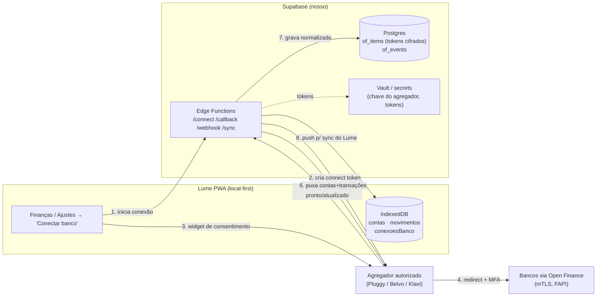

# Open Finance no Lume — arquitetura e plano

> Documento de planejamento. Nada aqui está implementado ainda. Serve de guia
> para quando estruturarmos a versão final do Lume, em que a sincronização
> bancária alimenta automaticamente Finanças (e, por tabela, Hoje, Agenda,
> objetivos e insights).

## 1. Objetivo

Hoje as **contas** e **movimentos** de Finanças são preenchidos à mão. Com
Open Finance, o objetivo é:

- **Saldos de contas/ativos atualizados sozinhos** (corrente, poupança, cartão,
  investimentos, dívidas) → o **patrimônio líquido** vira um número vivo.
- **Transações importadas automaticamente** como `movimentos` → o **Orçamento
  Inteligente**, a **distribuição do orçamento** e os **insights** deixam de
  depender de registro manual.
- **Categorização automática** das transações nas categorias do Lume.
- Tudo isso **opcional e gated**, como já é o login/sincronização: quem não
  conectar, o app segue 100% local-first e manual.

O modelo de dados criado na v0.42 (`contas`, `movimentos`, `objetivos`,
`orcamentoLinhas`) já é o destino natural — Open Finance **não exige refazer
telas**, só passa a alimentá-las.

## 2. A realidade do Open Finance Brasil (por que precisa de backend)

O Open Finance Brasil é um ecossistema **regulado pelo Banco Central**. Não dá
para chamá-lo direto do navegador:

- Exige **mTLS** (certificados de transporte), **assinatura de mensagens** e
  segredos de cliente que **não podem viver num PWA** (qualquer um leria no
  DevTools).
- O acesso é restrito a **instituições autorizadas** ou a quem usa um
  **agregador/iniciador autorizado** (TPP) que já é regulado.
- O fluxo de consentimento é um **redirect OAuth 2.0 / FAPI** para o banco,
  com validade e escopos definidos pelo BCB.

**Conclusão:** precisamos de (a) um **agregador** que já seja participante
autorizado e (b) um **backend fino** nosso para guardar segredos e orquestrar.
Isso muda um pouco a filosofia local-first — os dados bancários passam por um
servidor terceiro —, por isso o recurso é **opt-in e claramente sinalizado**.

## 3. Arquitetura recomendada

Usar um **agregador** (não falar com os bancos direto) + **Supabase Edge
Functions** como backend fino (o Lume já usa Supabase como nuvem opcional, então
reaproveitamos infra, Auth e RLS).

Regra de ouro: **tokens bancários e segredos do agregador só existem no
backend** (Vault / service role). O cliente recebe apenas **os dados do próprio
usuário** (saldos e transações), que podem viver no IndexedDB como qualquer
outro dado do Lume.

## 4. Fluxo de consentimento (conectar um banco)

1. Usuário toca **"Conectar banco"** em Ajustes de Finanças.
2. Cliente chama `POST /of/connect` → Edge Function pede um **connect token** ao
   agregador e devolve a URL/config do **widget** do agregador.
3. Widget abre (redirect ou modal), usuário escolhe o banco, autentica e
   **consente** os escopos (contas, saldos, transações) direto no banco.
4. Agregador cria um **item** (a conexão) e dispara **webhook** para
   `POST /of/webhook` quando o item está pronto.
5. Edge Function troca/guarda os tokens **cifrados** no Vault, cria a linha em
   `of_items` e faz a **primeira carga** (contas + histórico de transações).
6. Cliente é notificado (via sync) e mostra as contas importadas para o usuário
   **mapear/confirmar** (ex.: "Conta Corrente Nubank" → cria/atualiza uma
   `conta` do Lume).

Detalhes importantes:
- **Consentimento tem validade** (padrão do Open Finance ≈ 12 meses) → precisamos
  de **renovação** com aviso antecipado ("sua conexão com o banco X expira em N
  dias").
- Usuário pode **revogar** a qualquer momento (no Lume e no app do banco) →
  tratar `item.revoked`/`consent.revoked`.

## 5. Fluxo de sincronização (manter atualizado)

- **Webhooks** do agregador (`item/updated`, `transactions/created`) → fonte
  primária, quase em tempo real.
- **Fallback por polling**: uma Edge Function agendada (cron) revisita itens sem
  update há > X horas.
- Para cada atualização: puxar **saldos** (atualiza `conta.saldoCentavos`) e
  **transações novas** (insere `movimentos`), aplicar **categorização** e
  **deduplicação**, e propagar para o cliente pelo motor de sync existente.
- Ao final, gravar um **`patrimonioSnapshot`** do mês (já temos isso) para o
  gráfico de evolução continuar preciso.

## 6. Adições ao modelo de dados

### No Lume (IndexedDB, sincroniza como o resto)

Nova tabela **`conexoesBanco`** (schema v18):

| campo | tipo | descrição |
|---|---|---|
| `id` | string | id local |
| `provedor` | `'pluggy'\|'belvo'\|'klavi'` | agregador |
| `itemIdExterno` | string | id do item no agregador |
| `instituicao` | string | nome/So banco (ex.: "Nubank") |
| `logo` | string? | ícone da instituição |
| `status` | `'ativa'\|'atualizando'\|'erro'\|'expirada'\|'revogada'` | estado |
| `consentimentoExpiraEm` | number? | timestamp p/ avisar renovação |
| `ultimaSync` | number? | último sucesso |
| `criadoEm` / `atualizadoEm` | number | — |

**`contas`** ganha vínculo com a conexão (campos opcionais, retrocompatível):
`conexaoId?`, `contaExternaId?`, `sincronizada?: boolean`, `ultimoSaldoSyncEm?`.
Conta manual = sem `conexaoId` (funciona como hoje).

**`movimentos`** ganha origem e chaves de dedup:
`origem?: 'manual'|'openfinance'`, `externoId?`, `conexaoId?`,
`pendente?: boolean` (transação ainda não compensada), `hashDedup?`.

**`financasConfig`** ganha `openFinanceAtivo?: boolean`.

### No backend (Supabase Postgres, **nunca** vai para o cliente)

- `of_items` — item por conexão, **tokens cifrados** (Vault), refresh tokens,
  escopos, expiração do consentimento.
- `of_events` — log de webhooks (idempotência e auditoria).
- `of_account_map` — de-para conta externa ↔ `conta.id` do Lume.
- RLS por `user_id`; segredos só acessíveis via service role nas Edge Functions.

## 7. Categorização automática

- Agregadores já devolvem uma **categoria** e o **merchant** de cada transação.
- Manter uma **tabela de regras** de-para: categoria do agregador / merchant →
  **categoria do Lume** (Alimentação, Transporte, Moradia, Saúde, Educação,
  Lazer, Investimentos, Outros). Regras editáveis pelo usuário.
- Regras por **texto/merchant** ("IFOOD" → Alimentação, "UBER" → Transporte)
  com override manual que **vira aprendizado** (a próxima igual já entra certa).
- Evolução futura: modelo simples de classificação local (sem servidor) sobre o
  histórico do próprio usuário.

## 8. Deduplicação (manual × importado)

O usuário pode ter lançado um gasto à mão que depois chega pelo banco.

- Casar por **(valor, data ± 3 dias, descrição/merchant similar)**.
- Se casar: **mesclar** (mantém o registro, marca `origem='openfinance'`,
  vincula `externoId`) em vez de duplicar; avisar discretamente.
- Transação **pendente** (não compensada) entra como `pendente: true` e some/
  consolida quando o banco confirmar.
- Transferências **entre contas do próprio usuário** não contam como gasto/renda
  (detectar par saída+entrada de mesmo valor entre contas conectadas).

## 9. Como isso liga o Lume inteiro

- **Patrimônio líquido** e **evolução**: saldos reais e automáticos.
- **Orçamento Inteligente**: gasto do mês e "gasto de hoje" reais em tempo quase
  real → o "disponível hoje" fica muito mais preciso (some o atrito de registrar
  cada café). As reservas (recorrentes, eventos da Agenda, aportes) continuam
  como estão.
- **Recorrentes**: detectar automaticamente despesas fixas a partir do histórico
  (mesmo valor/merchant todo mês) e **sugerir** virar um `recorrente`.
- **Insights**: com dados completos, insights ficam muito mais fortes
  ("delivery caiu 24%", "assinaturas somam R$ X/mês", "3 dias sem gastar").
- **Hoje**: o cartão de Finanças mostra o disponível real do dia.
- **Agenda**: eventos com custo estimado podem, depois, ser **reconciliados**
  com a transação real quando ela chegar do banco.

## 10. Segurança, privacidade e LGPD

- **Opt-in explícito**, com tela de consentimento clara e um resumo do que será
  acessado (somente leitura; sem iniciação de pagamento nesta fase).
- Tokens e segredos **exclusivamente no backend** (Vault/secrets); cliente nunca
  os vê.
- **Revogação** fácil no Lume, que chama o agregador para encerrar o item.
- **Expiração de consentimento** com aviso e renovação.
- Escopo mínimo: **apenas leitura** de contas/saldos/transações.
- Deixar explícito no onboarding que, ao conectar, **dados bancários trafegam
  pelo nosso backend** (deixa de ser puramente local para esse recurso).

## 11. Provedores (agregadores) — comparação rápida

| Provedor | Notas |
|---|---|
| **Pluggy** | Brasileiro, foco Open Finance BR, boa DX/sandbox, webhooks. Forte candidato. |
| **Belvo** | LatAm (BR/MX/CO), boa documentação, categorização inclusa. |
| **Klavi** | Brasileiro, autorizado, foco Open Finance. |

Todos abstraem o mTLS/FAPI e entregam **contas + transações + categorias** por
API REST. A escolha final depende de **cobertura de bancos**, **preço** e
**qualidade da categorização**. Recomendo começar por **sandbox** de um deles
antes de decidir.

## 12. Custos

- Agregadores cobram tipicamente **por conexão/conta ativa por mês** (ou por
  chamada). Para um app pessoal single-user o custo é baixo; para multiusuário,
  precisa entrar no modelo de negócio.
- Backend: Supabase (Edge Functions + Postgres) provavelmente cabe no plano que
  já existir para a sincronização.

## 13. Roadmap em fases

1. **Fundação backend** — Edge Functions (`/connect`, `/callback`, `/webhook`,
   `/sync`), tabelas `of_*`, Vault, RLS. Escolher agregador e validar em
   **sandbox**.
2. **Conectar + primeira carga** — widget de consentimento, importar contas,
   tela de **mapeamento conta externa → `conta` do Lume**, importar histórico.
3. **Sync contínuo** — webhooks + polling de fallback; atualização de saldos e
   novas transações; snapshots mensais.
4. **Categorização + dedup** — de-para de categorias, regras por merchant,
   merge com lançamentos manuais, transferências internas.
5. **Automação inteligente** — detectar recorrentes, reconciliar custos de
   eventos da Agenda, insights avançados, aviso de renovação de consentimento.
6. **Robustez** — reautenticação, erros por banco, revogação, LGPD/retention,
   observabilidade.

## 14. Decisões em aberto (para quando formos encarar)

- Qual **agregador** (cobertura × preço × categorização)?
- **Single-user** (só você) ou **multiusuário** desde já? (muda custo e RLS)
- Guardar histórico de transações também no **backend** (fonte da verdade) ou só
  no cliente com o backend como passагem? (recomendo backend como fonte + espelho
  no cliente)
- Apenas **leitura** agora e **iniciação de pagamento** nunca / depois?
- Política de **retenção** de dados ao desconectar (apagar tudo? manter só o
  agregado do patrimônio?).

---

**TL;DR:** o Lume já tem o modelo de dados certo (`contas`/`movimentos`). Falta
um **agregador autorizado** + um **backend fino no Supabase** para o consentimento
e a sincronização, mantendo o recurso **opcional e gated**. Com isso, patrimônio,
orçamento e insights passam a se atualizar sozinhos — o Lume vira, de verdade, um
sistema financeiro automatizado, sem perder o espírito local-first para quem não
quiser conectar.
